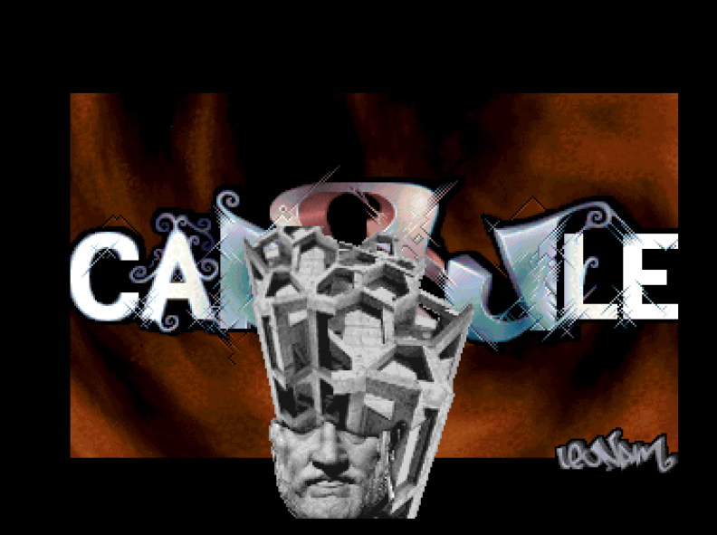

Working with Sprites
================

The Amiga computer supports 8 [hardware sprites](http://amigadev.elowar.com/read/ADCD_2.1/Hardware_Manual_guide/node00AE.html). On AGA machines these can be up to 64 pixels wide. Sprites are always 2 bitplanes deep, meaning they can represent 3 colours + 0 for transparency. You can also attach odd and even sprites and create 4 bitplane sprites, which allows you to have 15 colours plus transparency.

The Tornado [Display](Displays.md) subsystem has support for sprites on its Amiga implementation. Sprite hardware is not emulated on the posix/SDL side yet.

Before you read this section make sure you have familiarised yourself with the [Anatomy of an effect](AnatomyOfAnEffect.md), [Anatomy of a  Demo](AnatomyOfADemo.md) and [Display](Displays.md) sections of this manual.

The sprites used by Tornado are created using the ```bmp2bpl``` tool and the output contains the sprite data as well as its palette in a ```t_bpl_head``` structure defined in the ```bpl_headers.h``` file:

```c
typedef struct {
  unsigned char type, typeb;
  unsigned short w, h;
  unsigned short FILL;
  unsigned char data[1];
} t_bpl_head;
```

This is all handled internally by Tornado and you don't need to worry about the details but need to keep 
a few things in mind:

* Sprites cannot be wider than 64 pixels. There's no limitation on how tall they can be.
* Attached sprites can represent images up to 15 colours + transparency. Your source image should not have more than 15 colours.
* Colour 0 is always transparent. 

The way you are going to use and manipulate sprites is by using the ```sprite_options``` structure as defined in ```graphics.h```.

```c
typedef struct {
  int num_sprites;
  int spritesX[8];
  int spritesY[8];
  int spritesAttach[8];
  t_bpl_head *spr_data;

} sprite_options;
```

* ```num_sprites``` defines the number of sprites that this structure holds.
* ```spritesX``` is an array with the X position of all the possible sprites.
* ```spritesY``` is an array with the Y position of all the possible sprites.
* ```spritesAttach``` is an array with the attach settings of all the possible sprites.

A few things to consider:

* Unused sprites do not need their positions/attach settings set.
* The leftmost visible position on a PAL screen is [not 0](http://amigadev.elowar.com/read/ADCD_2.1/Hardware_Manual_guide/node00B1.html). The X position is always counted in superhires pixels to provide sub-pixel positioning precision on low res screens.
* Similarly, the topmost visible position on a PAL screen is [not 0](http://amigadev.elowar.com/read/ADCD_2.1/Hardware_Manual_guide/node00B1.html). The Y position is always counted in superhires pixels to provide sub-pixel positioning precision on low res screens.
* [Display](Displays.md) instances can only hold one set of sprites. If you need to switch between sprite sets simply create as many display instances as sprites sets you have.
* Sprites use palette colours 240 to 255. Your display palette will be merged with the sprite's one during initialisation. This means on a 256 colour mode you should not use colours above 240 if you plan to use sprites.

We are going to use the ```sprites``` example as a guide to see how to work with sprites:

Display initialisation
--------------------------

First let's declare a ```sprite_options``` struct that will hold our sprite data:

```c
static sprite_options so;
```

We have loaded a sprite asset as part of the effect initialisation which is now stored in ```effect->Assets[1]```. Let's set up the sprites data and initialise the display:

```c
  // Set up our sprites...
  so.num_sprites = 4;
  so.spritesX[0] = 850;
  so.spritesX[1] = so.spritesX[0];
  so.spritesX[2] = so.spritesX[0] + 256;
  so.spritesX[3] = so.spritesX[0] + 256;
  so.spritesY[0] = 0x52 + 64;
  so.spritesY[1] = so.spritesY[0];
  so.spritesY[2] = so.spritesY[0];
  so.spritesY[3] = so.spritesY[0];
  so.spritesAttach[0] = 0;
  so.spritesAttach[1] = 1;
  so.spritesAttach[2] = 0;
  so.spritesAttach[3] = 1;
  so.spr_data = (t_bpl_head *) effect->Assets[1];
	
  // 320x256 8 bitplanes. No padding. Sprites.
  displayInstance = display_init(pal, tornadoOptions, SCR_NORMAL, 0, 0, &so);
```

We have 4 sprites that we are going to attach to form a single 128 pixel wide 16-colour image.

We've set the first sprite's X position to 850 and copied it to the other 3, adding a 256 offset to the last two. Why? Because sprite positions are always set in superhires pixels, that 256 actually means 256 / 4 = 64 low res pixels to the right of the first two sprites.

The Y position is the same for every sprite in this example, but doesn't have to.

We are attaching sprite 1 to 0 and 3 to 2. 

The last member of the struct is a pointer to the sprite data we just loaded.

Let's see what it looks like:



**Remember that sprites will not be shown on the posix/SDL target.**


Moving sprites
-------------------

The position of your sprites does not have to remain static and you can move them around as you wish. You should, however, only do this on your vertical blank callback. Altering sprite control words while the sprite DMA is actively accessing them can result in corrupted sprite data being displayed.

Let's see how the sprites example does it:

```c
void vblSprites(int frame) {
  so.spritesX[0] = 850 + (int)(250.0f * sin(((float)frame) * 0.1f));
  so.spritesX[1] = so.spritesX[0];
  so.spritesX[2] = so.spritesX[0] + 256;
  so.spritesX[3] = so.spritesX[0] + 256;
  display_set_sprites_pos(displayInstance, &so);
}
```

First we modify the X position of the sprites depending on what frame we're in.

Then we call ```display_set_sprites_pos``` to re-generate the control words and copy them to Chip RAM.

Simple enough!